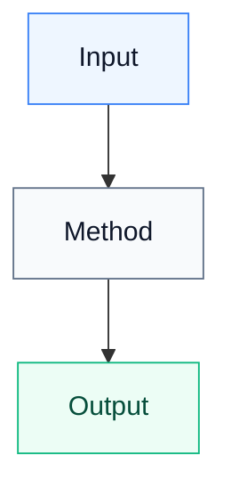

# Mermaid Research Diagram

## When to Use
Use this skill when the user asks to:
- Visualize a research paper, technical blog, AI writeup, benchmark, architecture post, or system design.
- Generate a Mermaid diagram from pasted text, a URL, a PDF, screenshots, notes, or excerpts.
- Explain a technical article visually.
- Create diagrams for tweets, talks, READMEs, notebooks, docs, or study notes.
- Compare methods, thresholds, regimes, pipelines, architectures, or experimental findings.
Do not use this skill for ordinary code explanations unless the user specifically asks for a diagram or visual model.

## Goal
Create Mermaid diagrams that make dense technical writing easier to understand while staying faithful to the source. The diagram should clarify the paper or blog post; it should not invent claims, overstate results, or imply causality that the source does not support.

## Workflow
1. Identify the source material.
   - If the user pasted enough text, use it directly.
   - If the user provided a URL, fetch/read the page when possible.
   - If the user provided a PDF or image, inspect it before summarizing.
   - If the source is incomplete, say what is missing and proceed with the available context.
2. Extract the key technical structure.
   - Problem being solved.
   - Main method or system.
   - Inputs and outputs.
   - Pipeline stages.
   - Experimental setup.
   - Conditions or regimes.
   - Main findings.
   - Limitations and caveats.
3. Choose the diagram type that best matches the source.
   - Use `flowchart TD` for pipelines, decision logic, and conceptual explanations.
   - Use `sequenceDiagram` for multi-agent workflows, protocols, API calls, or runtime interactions.
   - Use `stateDiagram-v2` for lifecycle/state transitions.
   - Use `graph LR` or `flowchart LR` for compact tweet-friendly diagrams.
   - Use multiple small diagrams instead of one crowded diagram when the topic has distinct pieces.
4. Preserve uncertainty.
   - Use phrases like "in the experiments", "according to the post", "suggests", or "reported" when appropriate.
   - Do not present benchmark-specific observations as universal laws.
   - Separate claims, mechanisms, and speculation.
5. Produce a diagram and a short explanation.
   - Start with a one-sentence framing of what the diagram shows.
   - Include the Mermaid code block.
   - Add a concise explanation of the important edges/nodes.
   - Add caveats if the source has limitations or if the diagram abstracts away details.

## Diagram Design Rules
- Prefer 6-14 nodes for a single diagram.
- Use short labels. If a label needs more than one clause, split it into multiple nodes.
- Use explicit branch labels for conditions, regimes, or experimental settings.
- Keep node labels factual and source-grounded.
- Avoid visual clutter: no more than 3-4 class colors unless useful.
- Use color/classes only to distinguish meaningful categories such as input, method, regime, output, limitation.
- For tweet-friendly output, produce a second smaller diagram after the detailed one.
- Mermaid code should be valid and copy-pasteable.

## Mermaid Syntax Preferences
- Quote labels that contain punctuation, parentheses, slashes, comparison symbols, or line breaks.
- Use `<br/>` for intentional line breaks inside node labels.
- Avoid raw Markdown emphasis inside Mermaid node labels.
- Prefer stable node IDs like `A`, `B`, `C`, or semantic IDs like `Input`, `Method`, `Worker`.
- When using class styles, define them at the bottom.

Example style block:



## Accuracy Checklist
Before finalizing, verify:
- The diagram’s main claim matches the source.
- Directional arrows imply only relationships supported by the source.
- Regime/threshold labels match the source exactly when numbers are provided.
- Benchmarks are identified as benchmark-specific.
- Limitations are included if the source mentions them.
- Any user-provided wording for a tweet or post is preserved unless improving clarity.

## Research Post Guidance
When diagramming a research post:
- Separate "method" from "results".
- Separate "observed in benchmark" from "general intuition".
- Include data flow: source context → transformation → model/worker → output.
- Include experimental regimes if they explain why different results occur.
- Include limitations in a side branch when relevant.
- Include metrics only if they are explicit in the source.

## AI Agent and Context Engineering Guidance
When the topic involves agents, context windows, KV cache, compaction, memory, or orchestration:
- Distinguish between prompt tokens, worker tokens, prefill cost, and KV cache pressure.
- Be careful not to claim KV cache savings unless the source or user context supports it. Safer wording: "shorter downstream context can reduce prefill and KV cache pressure."
- Distinguish raw transcript compression from structured real-time capture.
- For multi-agent systems, show handoffs explicitly: orchestrator → briefing/compaction → worker → output.
- If discussing "noisy trajectories", clarify whether the noise is speculative reasoning, irrelevant tool output, repeated logs, failed hypotheses, or redundant context.

## Output Formats
Default response should include:
1. A concise framing sentence.
2. A detailed Mermaid diagram.
3. A short explanation of what the diagram captures.
4. Optional tweet-friendly version if the user is preparing social content.
Use this response template by default:
~~~markdown
This diagram shows [one-sentence explanation].

```mermaid
[diagram]
```

Key points:
- [What the main branch/pipeline means]
- [What the important regimes/states/components mean]
- [Important caveat or limitation]
~~~

If the user asks for an image or screenshot:
- Provide the Mermaid code first.
- Suggest rendering it in Mermaid Live Editor or a Markdown viewer that supports Mermaid.
- If working in a repo or local environment, offer to create a `.md` file with the Mermaid block.

## Examples
**Example 1: Research excerpt**
Input: "Make a Mermaid diagram explaining this paper excerpt about adaptive context compaction."
Output: A `flowchart TD` showing input context, compaction method, regime selection, model/worker, outputs, and limitations.

**Example 2: Technical blog URL**
Input: "Can you visualize this architecture post?"
Output: Fetch or read the post if possible, identify the system components and request flow, then produce a `sequenceDiagram` or `flowchart TD` with a short caveat about any assumptions.

**Example 3: Tweet preparation**
Input: "Make this into a tweet-friendly Mermaid diagram."
Output: Produce a compact `flowchart LR` with short labels, then provide 2-4 bullets the user can use in the tweet.

**Example 4: Benchmark result**
Input: "Diagram why different thresholds win in this benchmark."
Output: Show a decision tree or flowchart with benchmark conditions on the branches and explicitly label observations as "in the experiments."

## Tone
- Be concise and technically precise.
- Do not overpraise the source.
- When uncertain, say so briefly and preserve the caveat in the diagram or explanation.
- Prefer "the post reports" or "in their experiments" over universal claims.
